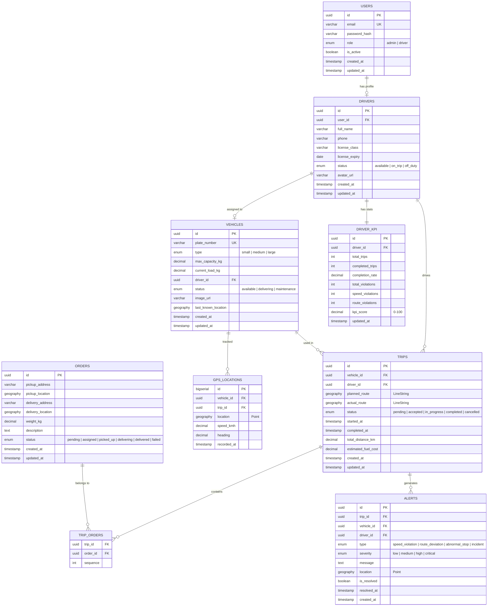
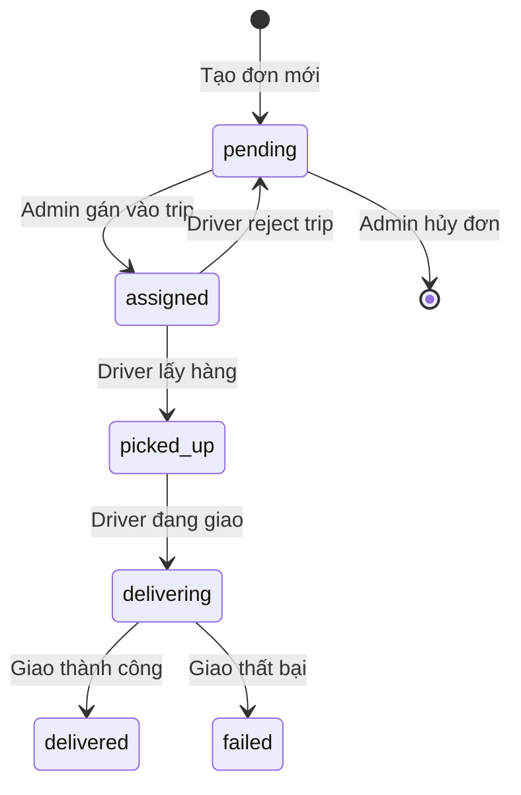
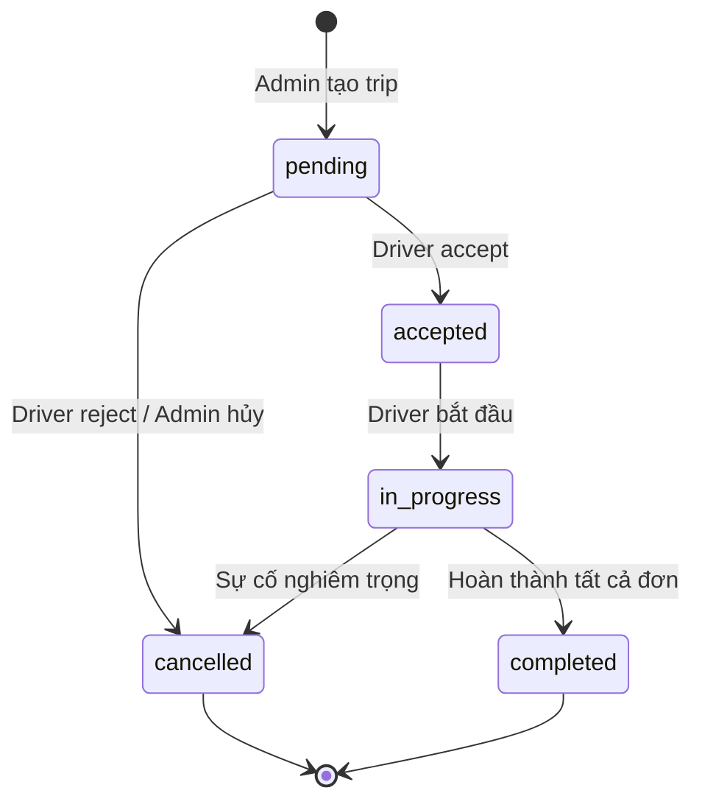
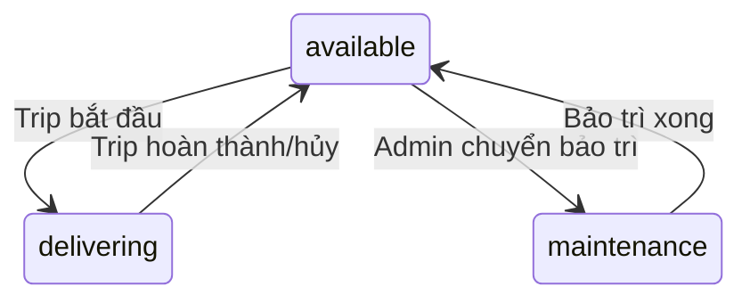

# 🎨 DESIGN: FleetTracker — Thiết Kế Chi Tiết

**Ngày tạo:** 2026-05-02
**Dựa trên:** [SPECS](specs/fleet_tracker_spec.md) | [BRIEF](BRIEF.md) | [Plan](../plans/260502-1035-fleet-tracker/plan.md)

---

## 1. Database Design (Cách Lưu Thông Tin)

### 1.1. ERD — Sơ Đồ Quan Hệ



### 1.2. Giải thích quan hệ

```
👤 1 User (tài khoản) ←→ 1 Driver (thông tin tài xế)
👨‍✈️ 1 Driver ←→ 0-1 Vehicle (1 tài xế lái tối đa 1 xe)
🚗 1 Vehicle → nhiều Trips (1 xe chạy nhiều chuyến)
📦 1 Trip → nhiều Orders (1 chuyến giao nhiều đơn)
📦 1 Order → 0-1 Trip (1 đơn thuộc tối đa 1 chuyến)
📍 1 Vehicle → nhiều GPS_Locations (lịch sử vị trí)
🚨 1 Trip → nhiều Alerts (vi phạm trong chuyến)
📊 1 Driver ←→ 1 Driver_KPI (thống kê hiệu suất)
```

---

## 2. SQL Schema Chi Tiết

### 2.1. Extensions & Enums

```sql
-- Enable PostGIS
CREATE EXTENSION IF NOT EXISTS postgis;
CREATE EXTENSION IF NOT EXISTS "uuid-ossp";

-- Enums
CREATE TYPE user_role AS ENUM ('admin', 'driver');
CREATE TYPE driver_status AS ENUM ('available', 'on_trip', 'off_duty');
CREATE TYPE vehicle_type AS ENUM ('small', 'medium', 'large');
CREATE TYPE vehicle_status AS ENUM ('available', 'delivering', 'maintenance');
CREATE TYPE order_status AS ENUM ('pending', 'assigned', 'picked_up', 'delivering', 'delivered', 'failed');
CREATE TYPE trip_status AS ENUM ('pending', 'accepted', 'in_progress', 'completed', 'cancelled');
CREATE TYPE alert_type AS ENUM ('speed_violation', 'route_deviation', 'abnormal_stop', 'incident');
CREATE TYPE alert_severity AS ENUM ('low', 'medium', 'high', 'critical');
```

### 2.2. Tables

```sql
-- USERS
CREATE TABLE users (
    id UUID PRIMARY KEY DEFAULT uuid_generate_v4(),
    email VARCHAR(255) UNIQUE NOT NULL,
    password_hash VARCHAR(255) NOT NULL,
    role user_role NOT NULL DEFAULT 'driver',
    is_active BOOLEAN DEFAULT true,
    created_at TIMESTAMPTZ DEFAULT NOW(),
    updated_at TIMESTAMPTZ DEFAULT NOW()
);

-- DRIVERS
CREATE TABLE drivers (
    id UUID PRIMARY KEY DEFAULT uuid_generate_v4(),
    user_id UUID UNIQUE NOT NULL REFERENCES users(id) ON DELETE CASCADE,
    full_name VARCHAR(100) NOT NULL,
    phone VARCHAR(15) NOT NULL,
    license_class VARCHAR(10) NOT NULL,
    license_expiry DATE NOT NULL,
    status driver_status DEFAULT 'available',
    avatar_url VARCHAR(500),
    created_at TIMESTAMPTZ DEFAULT NOW(),
    updated_at TIMESTAMPTZ DEFAULT NOW()
);

-- VEHICLES
CREATE TABLE vehicles (
    id UUID PRIMARY KEY DEFAULT uuid_generate_v4(),
    plate_number VARCHAR(20) UNIQUE NOT NULL,
    type vehicle_type NOT NULL,
    max_capacity_kg DECIMAL(10,2) NOT NULL CHECK (max_capacity_kg > 0),
    current_load_kg DECIMAL(10,2) DEFAULT 0,
    driver_id UUID REFERENCES drivers(id) ON DELETE SET NULL,
    status vehicle_status DEFAULT 'available',
    image_url VARCHAR(500),
    last_known_location GEOGRAPHY(Point, 4326),
    created_at TIMESTAMPTZ DEFAULT NOW(),
    updated_at TIMESTAMPTZ DEFAULT NOW()
);

-- ORDERS
CREATE TABLE orders (
    id UUID PRIMARY KEY DEFAULT uuid_generate_v4(),
    pickup_address VARCHAR(500) NOT NULL,
    pickup_location GEOGRAPHY(Point, 4326) NOT NULL,
    delivery_address VARCHAR(500) NOT NULL,
    delivery_location GEOGRAPHY(Point, 4326) NOT NULL,
    weight_kg DECIMAL(10,2) NOT NULL CHECK (weight_kg > 0),
    description TEXT,
    status order_status DEFAULT 'pending',
    created_at TIMESTAMPTZ DEFAULT NOW(),
    updated_at TIMESTAMPTZ DEFAULT NOW()
);

-- TRIPS
CREATE TABLE trips (
    id UUID PRIMARY KEY DEFAULT uuid_generate_v4(),
    vehicle_id UUID NOT NULL REFERENCES vehicles(id),
    driver_id UUID NOT NULL REFERENCES drivers(id),
    planned_route GEOGRAPHY(LineString, 4326),
    actual_route GEOGRAPHY(LineString, 4326),
    status trip_status DEFAULT 'pending',
    started_at TIMESTAMPTZ,
    completed_at TIMESTAMPTZ,
    total_distance_km DECIMAL(10,2),
    estimated_fuel_cost DECIMAL(12,2),
    created_at TIMESTAMPTZ DEFAULT NOW(),
    updated_at TIMESTAMPTZ DEFAULT NOW()
);

-- TRIP_ORDERS (junction table)
CREATE TABLE trip_orders (
    trip_id UUID REFERENCES trips(id) ON DELETE CASCADE,
    order_id UUID REFERENCES orders(id),
    sequence INT NOT NULL DEFAULT 1,
    PRIMARY KEY (trip_id, order_id)
);

-- GPS_LOCATIONS (high volume — BIGSERIAL)
CREATE TABLE gps_locations (
    id BIGSERIAL PRIMARY KEY,
    vehicle_id UUID NOT NULL REFERENCES vehicles(id),
    trip_id UUID REFERENCES trips(id),
    location GEOGRAPHY(Point, 4326) NOT NULL,
    speed_kmh DECIMAL(6,2) DEFAULT 0,
    heading DECIMAL(5,2) DEFAULT 0,
    recorded_at TIMESTAMPTZ NOT NULL DEFAULT NOW()
);

-- ALERTS
CREATE TABLE alerts (
    id UUID PRIMARY KEY DEFAULT uuid_generate_v4(),
    trip_id UUID REFERENCES trips(id),
    vehicle_id UUID NOT NULL REFERENCES vehicles(id),
    driver_id UUID NOT NULL REFERENCES drivers(id),
    type alert_type NOT NULL,
    severity alert_severity DEFAULT 'medium',
    message TEXT NOT NULL,
    location GEOGRAPHY(Point, 4326),
    is_resolved BOOLEAN DEFAULT false,
    resolved_at TIMESTAMPTZ,
    created_at TIMESTAMPTZ DEFAULT NOW()
);

-- DRIVER_KPI (aggregate table)
CREATE TABLE driver_kpi (
    id UUID PRIMARY KEY DEFAULT uuid_generate_v4(),
    driver_id UUID UNIQUE NOT NULL REFERENCES drivers(id) ON DELETE CASCADE,
    total_trips INT DEFAULT 0,
    completed_trips INT DEFAULT 0,
    completion_rate DECIMAL(5,2) DEFAULT 0,
    total_violations INT DEFAULT 0,
    speed_violations INT DEFAULT 0,
    route_violations INT DEFAULT 0,
    kpi_score DECIMAL(5,2) DEFAULT 100,
    updated_at TIMESTAMPTZ DEFAULT NOW()
);
```

### 2.3. Indexes (Tối ưu truy vấn)

```sql
-- GPS: query by vehicle + time range (route replay, live tracking)
CREATE INDEX idx_gps_vehicle_time ON gps_locations(vehicle_id, recorded_at DESC);
CREATE INDEX idx_gps_trip ON gps_locations(trip_id);

-- Spatial indexes (PostGIS)
CREATE INDEX idx_vehicles_location ON vehicles USING GIST(last_known_location);
CREATE INDEX idx_orders_pickup ON orders USING GIST(pickup_location);
CREATE INDEX idx_orders_delivery ON orders USING GIST(delivery_location);
CREATE INDEX idx_gps_location ON gps_locations USING GIST(location);

-- Common query patterns
CREATE INDEX idx_orders_status ON orders(status);
CREATE INDEX idx_trips_status ON trips(status);
CREATE INDEX idx_trips_driver ON trips(driver_id);
CREATE INDEX idx_trips_vehicle ON trips(vehicle_id);
CREATE INDEX idx_alerts_trip ON alerts(trip_id);
CREATE INDEX idx_alerts_resolved ON alerts(is_resolved);
```

### 2.4. PostGIS Queries Thường Dùng

```sql
-- Tìm xe gần điểm lấy hàng nhất (dispatch suggest)
SELECT v.*, d.full_name as driver_name,
    ST_Distance(v.last_known_location, o.pickup_location) as distance_meters
FROM vehicles v
JOIN drivers d ON v.driver_id = d.id
JOIN orders o ON o.id = :orderId
WHERE v.status = 'available'
    AND d.status = 'available'
    AND d.license_expiry > CURRENT_DATE
    AND (v.max_capacity_kg - v.current_load_kg) >= o.weight_kg
ORDER BY distance_meters ASC
LIMIT 5;

-- Check xe có đi sai tuyến không (route deviation)
SELECT ST_Distance(
    ST_MakePoint(:lng, :lat)::geography,
    t.planned_route
) as deviation_meters
FROM trips t WHERE t.id = :tripId;
-- Nếu deviation_meters > 500 → ALERT!

-- Gom đơn gần nhau (clustering within 3km radius)
SELECT a.id as order_a, b.id as order_b,
    ST_Distance(a.pickup_location, b.pickup_location) as distance
FROM orders a, orders b
WHERE a.id < b.id
    AND a.status = 'pending' AND b.status = 'pending'
    AND ST_DWithin(a.pickup_location, b.pickup_location, 3000);
```

---

## 3. API Design Chi Tiết

### 3.1. Response Format (Chuẩn chung)

```typescript
// Success
{ "success": true, "data": {...}, "message": "OK" }

// Success with pagination
{
  "success": true,
  "data": [...],
  "meta": { "page": 1, "limit": 10, "total": 45, "totalPages": 5 }
}

// Error
{ "success": false, "error": { "code": "VALIDATION_ERROR", "message": "..." } }
```

### 3.2. Auth API

```
POST /api/auth/login
  Body: { email, password }
  Response: { accessToken, refreshToken, user: { id, email, role } }

POST /api/auth/refresh
  Body: { refreshToken }
  Response: { accessToken, refreshToken }

GET /api/auth/me
  Headers: Authorization: Bearer <token>
  Response: { id, email, role, driver?: { id, fullName, status } }
```

### 3.3. Vehicles API

```
GET /api/vehicles?page=1&limit=10&status=available&type=small&search=51A
  → Paginated list, filter by status/type, search by plate

POST /api/vehicles
  Body: { plateNumber, type, maxCapacityKg, driverId? }
  → Create vehicle (admin only)

PATCH /api/vehicles/:id
  Body: { plateNumber?, type?, maxCapacityKg?, driverId?, status? }
  → Update (admin only, block if delivering)

DELETE /api/vehicles/:id
  → Soft delete (admin only, block if delivering)

POST /api/vehicles/:id/image
  Body: FormData (file)
  → Upload image, return URL
```

### 3.4. Dispatch API

```
POST /api/dispatch/suggest
  Body: { orderId }
  Response: { suggestions: [{ vehicle, driver, distanceKm }] }
  → Top 5 xe gần nhất, đủ tải, driver rảnh

POST /api/dispatch/assign
  Body: { orderIds: [...], vehicleId }
  → Create trip, link orders, update statuses

POST /api/dispatch/cluster
  Body: { radiusKm?: 3 }
  Response: { clusters: [{ orderIds: [...], centroid }] }
  → Group nearby pending orders
```

### 3.5. Trips API

```
GET /api/trips/my            → Driver: chuyến của tôi
POST /api/trips/:id/accept   → Driver accept
POST /api/trips/:id/reject   → Driver reject
POST /api/trips/:id/start    → Bắt đầu chuyến
POST /api/trips/:id/complete → Hoàn thành (body: { photoUrl? })
POST /api/trips/:id/incident → Báo sự cố (body: { message? })

PATCH /api/orders/:id/status
  Body: { status: "picked_up" | "delivering" | "delivered" | "failed" }
  → Driver cập nhật trạng thái đơn
```

### 3.6. WebSocket Events

```
CLIENT → SERVER:
  gps:update → { vehicleId, tripId, lat, lng, speed, heading, timestamp }

SERVER → CLIENT (Admin room):
  vehicle:location → { vehicleId, lat, lng, speed, heading, timestamp }
  alert:new → { id, type, severity, message, vehicleId, location }
  trip:status → { tripId, status, vehicleId }

SERVER → CLIENT (Driver room):
  trip:assigned → { tripId, orders, vehicle }
  trip:cancelled → { tripId, reason }
```

---

## 4. State Machines (Trạng thái chuyển đổi)

### 4.1. Order Status



### 4.2. Trip Status



### 4.3. Vehicle Status



---

## 5. Component Hierarchy (Admin Dashboard)

```
App
├── AuthLayout
│   └── LoginPage
└── DashboardLayout
    ├── Sidebar
    │   ├── NavLink (Dashboard)
    │   ├── NavLink (Vehicles)
    │   ├── NavLink (Drivers)
    │   ├── NavLink (Orders)
    │   ├── NavLink (Dispatch)
    │   ├── NavLink (Tracking)
    │   └── NavLink (Reports)
    ├── Header
    │   ├── SearchInput
    │   ├── AlertBell (real-time count)
    │   └── UserMenu
    └── Pages
        ├── DashboardPage
        │   ├── StatCard × 4
        │   ├── TripChart (recharts)
        │   ├── ActiveTripsList
        │   └── RecentAlerts
        ├── VehiclesPage
        │   ├── FilterBar (status, type)
        │   ├── DataTable
        │   └── VehicleFormModal
        ├── DriversPage
        │   ├── FilterBar (status)
        │   ├── DataTable (with KPI badge)
        │   ├── DriverFormModal
        │   └── DriverKpiPage
        │       ├── KpiGauge
        │       ├── StatsGrid
        │       └── ViolationHistory
        ├── OrdersPage
        │   ├── FilterBar (status, date)
        │   ├── DataTable
        │   └── OrderFormModal
        │       └── MiniMap (geocoding)
        ├── DispatchPage
        │   ├── PendingOrderList
        │   ├── VehicleSuggestList
        │   └── DispatchMap
        ├── TrackingPage
        │   ├── FleetMap (MapBox component)
        │   │   ├── Marker (Vehicle/Order with dynamic color)
        │   │   ├── NavigationControl
        │   │   ├── Source/Layer (Route trails, Speed-based segments)
        │   │   └── GeofenceCorridor (Buffer visualization)
        │   ├── TrackingSidebar (Real-time vehicle status)
        │   ├── ReplayControls (Play, Pause, Timeline slider)
        │   └── AlertsList (Integrated with map focus)
        ├── ReplayPage (/tracking/replay)
        │   ├── HistoricalMap
        │   └── ReplayTimeline
        └── ReportsPage
            ├── DateRangePicker
            ├── FleetPerformanceCharts
            ├── KpiLeaderboard
            └── ExportButtons
```

---

## 6. Acceptance Criteria (Checklist Kiểm Tra)

### 6.1. Auth

```
✅ AC-AUTH-01: Đăng nhập
  □ Nhập email + password đúng → vào dashboard
  □ Nhập sai → hiện lỗi "Email hoặc mật khẩu sai"
  □ Bỏ trống → hiện validation "Vui lòng nhập"
  □ Token hết hạn → tự refresh hoặc redirect login
```

### 6.2. Vehicle Management

```
✅ AC-VEH-01: Xem danh sách xe
  □ Hiển thị: ảnh, biển số, loại, tải trọng, tài xế, trạng thái
  □ Filter theo status → chỉ hiện đúng status
  □ Search biển số → kết quả chính xác
  □ Pagination hoạt động (10/page)

✅ AC-VEH-02: Thêm xe mới
  □ Nhập đủ info → thêm thành công
  □ Biển số trùng → báo lỗi "Biển số đã tồn tại"
  □ Tải trọng <= 0 → báo lỗi
  □ Upload ảnh → hiển thị preview

✅ AC-VEH-03: Xóa xe
  □ Xe rảnh → xóa thành công
  □ Xe đang delivering → không cho xóa, hiện cảnh báo
```

### 6.3. Dispatch

```
✅ AC-DIS-01: Gợi ý xe
  □ Chọn đơn → hiện top 5 xe (sorted by distance)
  □ Xe không đủ tải → không hiện trong list
  □ Driver đang chạy → không hiện
  □ Bằng lái hết hạn → không hiện

✅ AC-DIS-02: Gán đơn
  □ Gán thành công → trip created + driver nhận thông báo
  □ Gán vào xe đang delivering → báo lỗi
```

### 6.4. GPS Tracking

```
✅ AC-GPS-01: Real-time tracking
  □ Xe di chuyển → marker cập nhật trên map (5-10s)
  □ 10 xe cùng lúc → map hoạt động mượt

✅ AC-GPS-02: Cảnh báo
  □ Tốc độ > 80 km/h → alert vượt tốc
  □ Lệch tuyến > 500m → alert sai tuyến
  □ Dừng > 10 phút → alert dừng bất thường
  □ Alert hiện trên dashboard ngay lập tức
```

### 6.5. Driver App

```
✅ AC-DRV-01: Nhận chuyến
  □ Chuyến mới → notification + hiện trong list
  □ Accept → chuyển sang Active
  □ Reject → đơn trả về pool

✅ AC-DRV-02: Chạy chuyến
  □ "Bắt đầu" → GPS tracking bắt đầu
  □ Cập nhật trạng thái đơn → admin thấy realtime
  □ "Hoàn thành" → chụp ảnh → upload → trip complete

✅ AC-DRV-03: SOS
  □ 1 tap → admin nhận alert critical ngay lập tức
```

---

## 7. Test Cases (Bài Kiểm Tra)

### TC-01: Login Happy Path
```
Given: User admin (admin@fleet.com / 123456)
When:  POST /auth/login { email, password }
Then:  ✓ 200 OK
       ✓ accessToken is valid JWT
       ✓ user.role = "admin"
```

### TC-02: Dispatch — Suggest Nearest Vehicle
```
Given: 3 vehicles available at different locations
       Order pickup at HCM center (10.776, 106.700)
       Vehicle A: 5km away, 500kg free capacity
       Vehicle B: 2km away, 300kg free capacity
       Vehicle C: 10km away, 1000kg free capacity
       Order weight: 200kg
When:  POST /dispatch/suggest { orderId }
Then:  ✓ Returns 3 vehicles
       ✓ Vehicle B first (nearest + enough capacity)
       ✓ Vehicle A second
       ✓ Vehicle C third
```

### TC-03: Speed Violation Alert
```
Given: Trip in_progress, max speed = 80 km/h
When:  GPS update: speed = 95 km/h
Then:  ✓ Alert created: type=speed_violation, severity=high
       ✓ WebSocket emit alert:new to admin room
       ✓ driver_kpi.speed_violations++
       ✓ driver_kpi.kpi_score decreased by 5
```

### TC-04: Route Deviation Alert
```
Given: Trip in_progress with planned_route (LineString)
When:  GPS update: location 800m from planned_route
Then:  ✓ Alert created: type=route_deviation
       ✓ WebSocket emit alert:new
```

### TC-05: Trip Complete → KPI Update
```
Given: Driver has: total_trips=10, completed=9, kpi=85
When:  POST /trips/:id/complete
Then:  ✓ Trip status = completed
       ✓ All orders = delivered
       ✓ Vehicle status = available, load = 0
       ✓ Driver status = available
       ✓ KPI: total=11, completed=10, rate=90.9%, score=85
```

### TC-06: Reject Trip → Orders Return to Pool
```
Given: Trip with 3 orders (total weight 500kg)
       Vehicle current_load = 500kg
When:  Driver rejects trip
Then:  ✓ Trip status = cancelled
       ✓ All 3 orders status = pending
       ✓ Vehicle current_load = 0kg
```

### TC-07: Cannot Delete Delivering Vehicle
```
Given: Vehicle with status = delivering
When:  DELETE /vehicles/:id
Then:  ✓ 400 Bad Request
       ✓ Error: "Không thể xóa xe đang giao hàng"
```

---

## 8. Config & Constants

```typescript
// fleet-api/src/common/constants.ts

export const CONFIG = {
  // GPS
  GPS_UPDATE_INTERVAL_MS: 5000,      // 5 seconds
  GPS_BATCH_INSERT_INTERVAL: 5000,   // batch insert every 5s

  // Alerts thresholds
  MAX_SPEED_KMH: 80,                 // Speed violation
  ROUTE_DEVIATION_METERS: 500,       // Route deviation
  IDLE_TIMEOUT_MINUTES: 10,          // Abnormal stop
  SPEED_VIOLATION_TOLERANCE_SEC: 3,  // Ignore GPS spikes

  // KPI penalties
  KPI_PENALTY_SPEED: 5,
  KPI_PENALTY_ROUTE: 8,
  KPI_PENALTY_IDLE: 3,
  KPI_PENALTY_INCIDENT: 10,
  KPI_MAX_SCORE: 100,

  // Fuel rates (L/100km)
  FUEL_RATE: {
    small: 8,
    medium: 12,
    large: 16,
  },
  FUEL_PRICE_VND: 25000,             // per liter

  // Dispatch
  DISPATCH_SUGGEST_LIMIT: 5,
  CLUSTER_RADIUS_METERS: 3000,       // 3km

  // Auth
  JWT_ACCESS_EXPIRY: '1h',
  JWT_REFRESH_EXPIRY: '7d',

  // Upload
  MAX_FILE_SIZE_MB: 5,
  ALLOWED_IMAGE_TYPES: ['image/jpeg', 'image/png', 'image/webp'],
};
```

---

## 9. Phase 08 - Maps & Monitoring (Technical Implementation)

### 9.1. MapBox Component Hardening
- **Prop Logic**: `MapBox` sử dụng `dynamic import` (`next/dynamic`) với `ssr: false` để tránh lỗi `window is not defined`.
- **Coordinate Sanitation**: Toàn bộ tọa độ được kiểm tra `isNaN()` trước khi truyền vào `Marker`. Tránh lỗi "Invalid LngLat object: (NaN, NaN)".
- **Marker Props**: Hỗ trợ `onClick` để truyền event từ bản đồ ra ngoài (vd: chọn xe để xem chi tiết).

### 9.2. Real-time Visualization
- **Trails**: Sử dụng `Source` type `geojson` với `LineString` để vẽ lịch sử di chuyển ngắn hạn.
- **Speed Segments**: Áp dụng `match` expressions trong `paint` property của layer để đổi màu tuyến đường theo tốc độ thực tế (Xanh: <40, Vàng: 40-70, Đỏ: >70).
- **Geofence Corridor**: Buffer 500m xung quanh `planned_route` được hiển thị bằng layer bán trong suốt để nhận diện xe đi lệch tuyến trực quan.

### 9.3. Route Replay Logic
- **Playback Engine**: Sử dụng `setInterval` nội bộ trong component để tịnh tiến `currentTime` của timeline.
- **Interpolation**: Tọa độ được nội suy giữa các điểm GPS thực tế để marker di chuyển mượt mà ngay cả khi dữ liệu thưa thớt.

---

*Tạo bởi AWF — Design Phase | FleetTracker v1.0*
